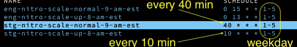

[Cron Job Schedule](https://www.freebsd.org/cgi/man.cgi?crontab%285%29)

[Cron Wiki](https://en.wikipedia.org/wiki/Cron)

[cronjob kubernetes](https://kubernetes.io/docs/tasks/job/automated-tasks-with-cron-jobs/)

The example cronjob - just generates a message into a busybox pod

│ hello Fri Apr 10 18:51:11 UTC 2020 │
│ hello Hello from the Kubernetes cluster │
│ hello stream closed

To change a particular item in the cron

`kubectl patch cronjobs hello -p "{ \"spec\" : { \"suspend\" : false }}" -n default`

#### Find the value of suspend

`kubectl describe cronjobs hello | grep Suspend`

┌───────────── minute (0 - 59)
│ ┌─ ── ── ──────── hour (0 - 23)
│ │ ┌─ ── ────────── day of the month (1 - 31)
│ │ │ ┌─ ──────────── month (1 - 12)
│ │ │ │ ┌───────────── day of the week (0 - 6) (Sunday to Saturday;
│ │ │ │ │ 7 is also Sunday on some systems)
│ │ │ │ │
│ │ │ │ │

* 
    * 
        * 
            * 
                * command to execute