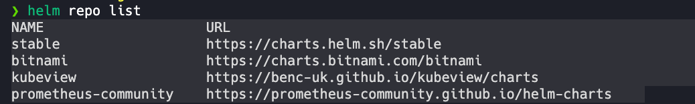
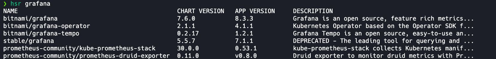
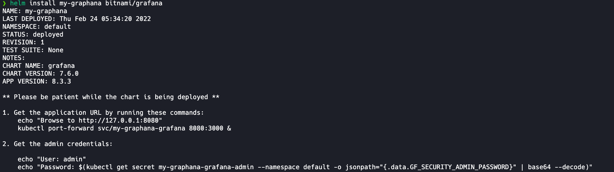

## What is Helm and HelmFile?
 Helm is a package manager for Kubernetes and Helmfile helps deploy helm charts. 

# Create a helm chart:
helm create chart_name

# List the repositories you have added



# Add a new helm repository:
helm repo add repo_name

# Remove a helm charts repository
helm repo remove repo_name

# Search for a helm chart by name in repos
helm search repo chart_name


# Install remote chart into cluster


#  kubectl get pods command output
```bash
❯ kubectl get pods
NAME                                  READY   STATUS    RESTARTS      AGE
nginx1                                1/1     Running   2 (22h ago)   16d
nginx2                                1/1     Running   2 (22h ago)   16d
nginx                                 1/1     Running   2 (22h ago)   18d
mytest-hello-58b7cb8b88-27j8p         1/1     Running   0             78m
my-graphana-grafana-8b68b98c9-t27rf   1/1     Running   0             27m
```

# Download remote chart into local directory
Retrieve a package from a package repository, and download it locally.

This is useful for fetching packages to inspect, modify, or repackage. It can
also be used to perform cryptographic verification of a chart without installing the chart.

There are options for unpacking the chart after download. This will create a
directory for the chart and uncompress into that directory.

 helm pull [chart URL | repo/chartname] [...] [flags]

 `helm pull bitnami/redis --untar --untardir charts`

 ```bash
❯ tree charts/redis
charts/redis
├── Chart.lock
├── Chart.yaml
├── README.md
├── charts
│   └── common
│       ├── Chart.yaml
│       ├── README.md
│       ├── templates
│       │   ├── _affinities.tpl
│       │   ├── _capabilities.tpl
│       │   ├── _errors.tpl
│       │   ├── _images.tpl
│       │   ├── _ingress.tpl
│       │   ├── _labels.tpl
│       │   ├── _names.tpl
│       │   ├── _secrets.tpl
│       │   ├── _storage.tpl
│       │   ├── _tplvalues.tpl
│       │   ├── _utils.tpl
│       │   ├── _warnings.tpl
│       │   └── validations
│       │       ├── _cassandra.tpl
│       │       ├── _mariadb.tpl
│       │       ├── _mongodb.tpl
│       │       ├── _postgresql.tpl
│       │       ├── _redis.tpl
│       │       └── _validations.tpl
│       └── values.yaml
├── ci
│   ├── extra-flags-values.yaml
│   ├── sentinel-values.yaml
│   └── standalone-values.yaml
├── img
│   ├── redis-cluster-topology.png
│   └── redis-topology.png
├── templates
│   ├── NOTES.txt
│   ├── _helpers.tpl
│   ├── configmap.yaml
│   ├── extra-list.yaml
│   ├── headless-svc.yaml
│   ├── health-configmap.yaml
│   ├── master
│   │   ├── psp.yaml
│   │   ├── service.yaml
│   │   └── statefulset.yaml
│   ├── metrics-svc.yaml
│   ├── networkpolicy.yaml
│   ├── pdb.yaml
│   ├── prometheusrule.yaml
│   ├── replicas
│   │   ├── hpa.yaml
│   │   ├── service.yaml
│   │   └── statefulset.yaml
│   ├── role.yaml
│   ├── rolebinding.yaml
│   ├── scripts-configmap.yaml
│   ├── secret.yaml
│   ├── sentinel
│   │   ├── hpa.yaml
│   │   ├── node-services.yaml
│   │   ├── ports-configmap.yaml
│   │   ├── service.yaml
│   │   └── statefulset.yaml
│   ├── serviceaccount.yaml
│   ├── servicemonitor.yaml
│   └── tls-secret.yaml
├── values.schema.json
└── values.yaml
 ```

# Update helm repositories:
helm repo update

# Helmfile allows for specifying default values to values.yaml