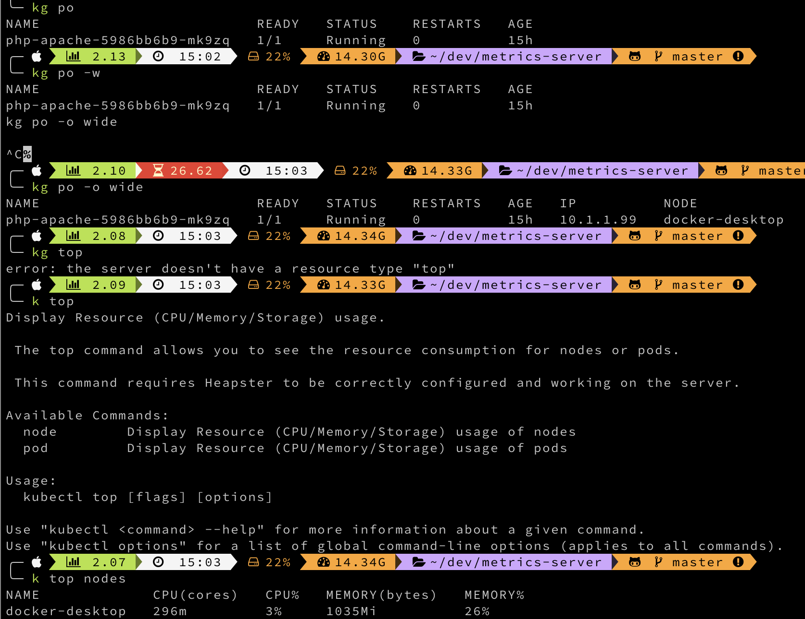
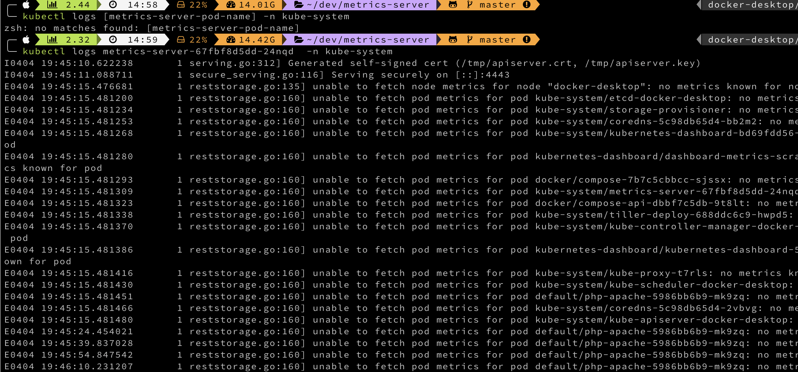
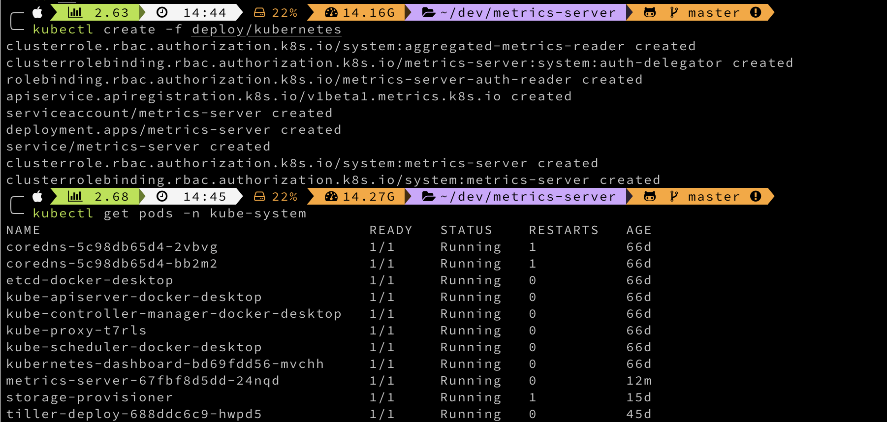
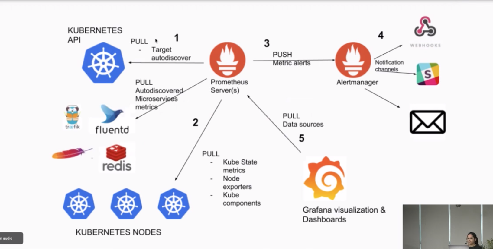

## Metrics Functionality Captures

### installing metrics using helm3 chart

```
helm install stable/metrics-server -n metrics --namespace kube-system --set args={--kubelet-insecure-tls} --generate-name
```

```
k top pod --all-namespaces
```

NAMESPACE | NAME | CPU(cores) | MEMORY(bytes)
----------|------|------------|--------------
default | logs-pod | 0m | 0Mi
kube-system | coredns-f9fd979d6-dhswt | 8m | 9Mi
kube-system | coredns-f9fd979d6-txkfb | 8m | 9Mi
kube-system | etcd-docker-desktop | 43m | 91Mi
kube-system | kube-apiserver-docker-desktop | 180m | 276Mi
kube-system | kube-controller-manager-docker-desktop | 45m | 40Mi
kube-system | kube-proxy-npw4z | 1m | 15Mi
kube-system | kube-scheduler-docker-desktop | 10m | 15Mi
kube-system | metrics-server-1626619957-696878cbb-k7wl5 | 4m | 13Mi
kube-system | storage-provisioner | 4m | 6Mi
kube-system | vpnkit-controller | 1m | 15Mi








