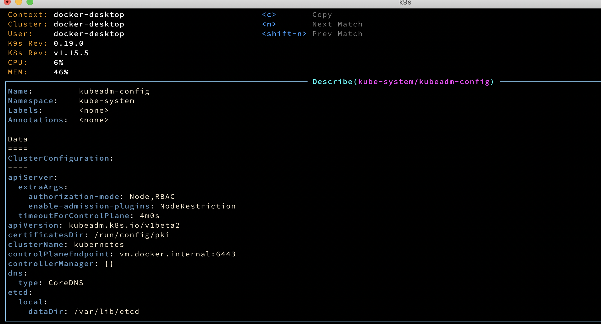
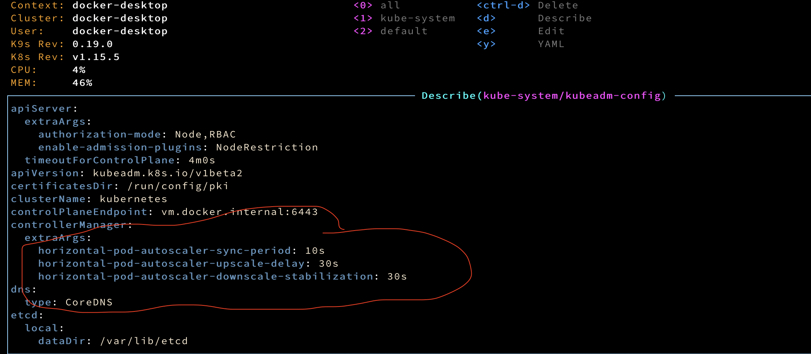

kubeadm config is present in the kube-system



Added the extrArgs section - to increase pod stabilization



### patch to increase min replicas

```kubectl patch hpa php-apache --patch '{"spec":{"minReplicas":3}}'```

### patch to increase min replicas

```kubectl patch hpa php-apache --patch '{"spec":{"minReplicas":15}}'```