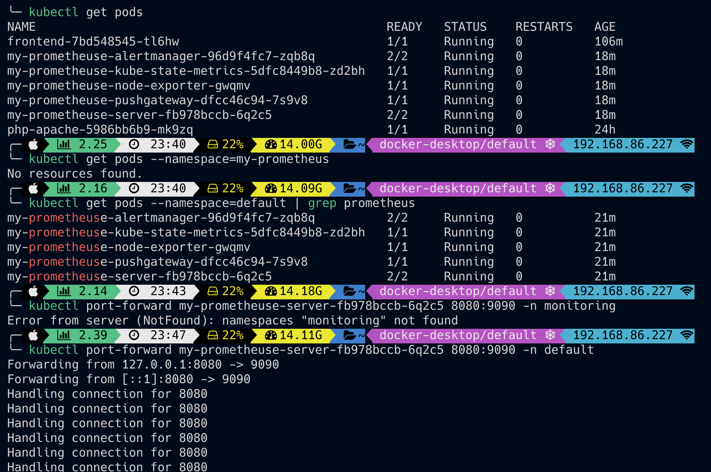

[Prometheus Install Walkthrough](https://devopscube.com/setup-prometheus-monitoring-on-kubernetes/)

> Output

```helm install --name my-prometheuse stable/prometheus```

NAME: my-prometheuse
LAST DEPLOYED: Sat Apr 4 23:22:19 2020
NAMESPACE: default
STATUS: DEPLOYED

RESOURCES:
==> v1/ConfigMap
NAME AGE
my-prometheuse-alertmanager 1s
my-prometheuse-server 1s

==> v1/DaemonSet
NAME AGE
my-prometheuse-node-exporter 1s

==> v1/Deployment
NAME AGE
my-prometheuse-alertmanager 1s
my-prometheuse-kube-state-metrics 1s
my-prometheuse-pushgateway 1s
my-prometheuse-server 1s

==> v1/PersistentVolumeClaim
NAME AGE
my-prometheuse-alertmanager 1s
my-prometheuse-server 1s

==> v1/Pod(related)
NAME AGE
my-prometheuse-alertmanager-96d9f4fc7-zqb8q 1s
my-prometheuse-kube-state-metrics-5dfc8449b8-zd2bh 1s
my-prometheuse-node-exporter-gwqmv 1s
my-prometheuse-pushgateway-dfcc46c94-7s9v8 1s
my-prometheuse-server-fb978bccb-6q2c5 1s

==> v1/Service
NAME AGE
my-prometheuse-alertmanager 1s
my-prometheuse-kube-state-metrics 1s
my-prometheuse-node-exporter 1s
my-prometheuse-pushgateway 1s
my-prometheuse-server 1s

==> v1/ServiceAccount
NAME AGE
my-prometheuse-alertmanager 1s
my-prometheuse-kube-state-metrics 1s
my-prometheuse-node-exporter 1s
my-prometheuse-pushgateway 1s
my-prometheuse-server 1s

==> v1beta1/ClusterRole
NAME AGE
my-prometheuse-alertmanager 1s
my-prometheuse-kube-state-metrics 1s
my-prometheuse-pushgateway 1s
my-prometheuse-server 1s

==> v1beta1/ClusterRoleBinding
NAME AGE
my-prometheuse-alertmanager 1s
my-prometheuse-kube-state-metrics 1s
my-prometheuse-pushgateway 1s
my-prometheuse-server 1s

NOTES:
The Prometheus server can be accessed via port 80 on the following DNS name from within your cluster:
my-prometheuse-server.default.svc.cluster.local

Get the Prometheus server URL by running these commands in the same shell:
export POD\_NAME=$(kubectl get pods --namespace default -l "app=prometheus,component=server" -o jsonpath="{.items[0].metadata.name}")
kubectl --namespace default port-forward $POD\_NAME 9090

The Prometheus alertmanager can be accessed via port 80 on the following DNS name from within your cluster:
my-prometheuse-alertmanager.default.svc.cluster.local

Get the Alertmanager URL by running these commands in the same shell:
export POD\_NAME=$(kubectl get pods --namespace default -l "app=prometheus,component=alertmanager" -o jsonpath="{.items[0].metadata.name}")
kubectl --namespace default port-forward $POD\_NAME 9093
#################################################################################

###### WARNING: Pod Security Policy has been moved to a global property.

###### use .Values.podSecurityPolicy.enabled with pod-based

###### annotations

###### (e.g. .Values.nodeExporter.podSecurityPolicy.annotations)

#################################################################################

The Prometheus PushGateway can be accessed via port 9091 on the following DNS name from within your cluster:
my-prometheuse-pushgateway.default.svc.cluster.local

Get the PushGateway URL by running these commands in the same shell:
export POD\_NAME=$(kubectl get pods --namespace default -l "app=prometheus,component=pushgateway" -o jsonpath="{.items[0].metadata.name}")
kubectl --namespace default port-forward $POD\_NAME 9091

For more information on running Prometheus, visit:
https://prometheus.io/

### Prometheus Dashboard

Connecting To Prometheus Dashboard
You can view the deployed Prometheus dashboard in two ways.

\*\*Using Kubectl port forwarding
\*\*Exposing the Prometheus deployment as a service with NodePort or a Load Balancer.

`kubectl port-forward my-prometheuse-server-fb978bccb-6q2c5 8080:9090 -n monitoring`

Navigate to http://localhost:8080 to see the prometheus dashboard



### Exposing Prometheus as a Service

To access the Prometheus dashboard over a IP or a DNS name, you need to expose it as Kubernetes service.

Step 1: Create a file named prometheus-service.yaml and copy the following contents. We will expose Prometheus on all kubernetes node IP's on port 30000.

Step 2: Create the service using the following command.

```kubectl create -f prometheus-service.yaml --namespace=default```

Step 3: Once created, you can access the Prometheus dashboard using any Kubernetes node IP on port 30000. If you are on the cloud, make sure you have the right firewall rules for accessing the apps.

### Install the prometheus adapter

```kubectl get --raw /apis/custom.metrics.k8s.io/v1beta1```

```helm install --name my-pro-adapter stable/prometheus-adapter```
NAME: my-pro-adapter
LAST DEPLOYED: Sun Apr 5 17:03:30 2020
NAMESPACE: default
STATUS: DEPLOYED

RESOURCES:
==> v1/ClusterRole
NAME AGE
prometheus-adapter-resource-reader 0s
prometheus-adapter-server-resources 0s

==> v1/ClusterRoleBinding
NAME AGE
prometheus-adapter-hpa-controller 0s
prometheus-adapter-resource-reader 0s
prometheus-adapter:system:auth-delegator 0s

==> v1/ConfigMap
NAME AGE
my-pro-adapter-prometheus-adapter 0s

==> v1/Deployment
NAME AGE
my-pro-adapter-prometheus-adapter 0s

==> v1/Pod(related)
NAME AGE
my-pro-adapter-prometheus-adapter-774d5df5f5-bvjwr 0s

==> v1/RoleBinding
NAME AGE
prometheus-adapter-auth-reader 0s

==> v1/Service
NAME AGE
my-pro-adapter-prometheus-adapter 0s

==> v1/ServiceAccount
NAME AGE
my-pro-adapter-prometheus-adapter 0s

==> v1beta1/APIService
NAME AGE
v1beta1.custom.metrics.k8s.io 0s

NOTES:
my-pro-adapter-prometheus-adapter has been deployed.
In a few minutes you should be able to list metrics using the following command(s):

```kubectl get --raw /apis/custom.metrics.k8s.io/v1beta1```

### Running kubernetes metrics, dashboard, prometheus, adapter and grafana

When running docker desktop & kubernetes

\*\* `kubectl proxy`

\*\* `kubectl port-forward my-prometheuse-server-fb978bccb-6q2c5 8080:9090 -n default`

Navigate to prometheus dash by:

http://localhost:8080