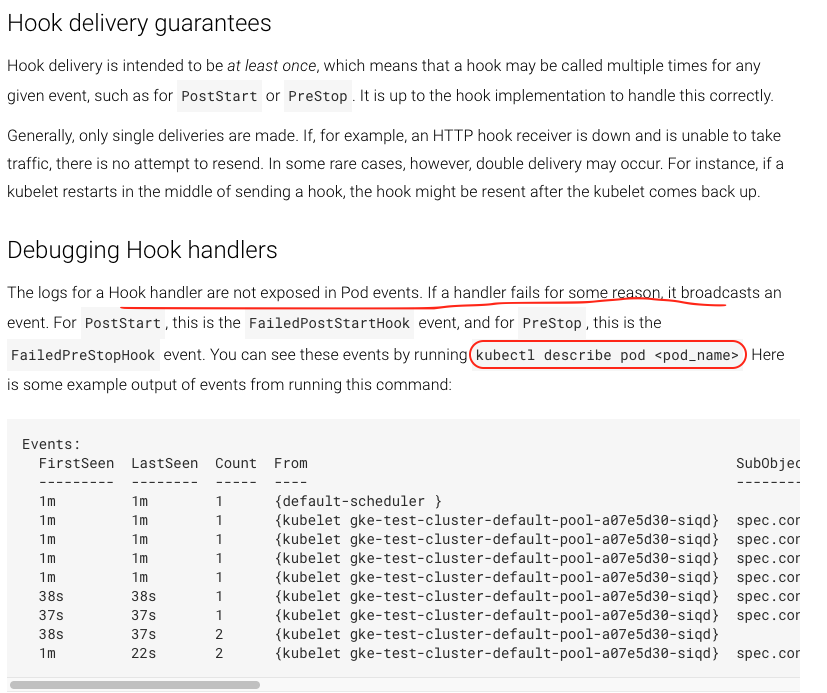

terminationGracePeriodSeconds (integer)

Optional duration in seconds the pod needs to terminate gracefully. May be decreased in delete request. Value must be non-negative integer. The value zero indicates delete immediately. If this value is nil, the default grace period will be used instead. The grace period is the duration in seconds after the processes running in the pod are sent a termination signal and the time when the processes are forcibly halted with a kill signal. Set this value longer than the expected cleanup time for your process. Defaults to 30 seconds.

lifecycle: Actions that the management system should take in response to container lifecycle events. Cannot be updated.

Lifecycle describes actions that the management system should take in response to container lifecycle events. For the PostStart and PreStop lifecycle handlers, management of the container blocks until the action is complete, unless the container process fails, in which case the handler is aborted.

postStart (object)

PostStart is called immediately after a container is created. If the handler fails, the container is terminated and restarted according to its restart policy. Other management of the container blocks until the hook completes. More info: https://kubernetes.io/docs/concepts/containers/container-lifecycle-hooks/#container-hooks

preStop (object)

PreStop is called immediately before a container is terminated. The container is terminated after the handler completes. The reason for termination is passed to the handler. Regardless of the outcome of the handler, the container is eventually terminated. Other management of the container blocks until the hook completes. More info: [https://kubernetes.io/docs/concepts/containers/container-lifecycle-hooks/#container-hooks](https://kubernetes.io/docs/concepts/containers/container-lifecycle-hooks/#container-hooks)

Because we are running in instance mode IP, the ALB is going to grab the IP of the pods that are visible in the services - 